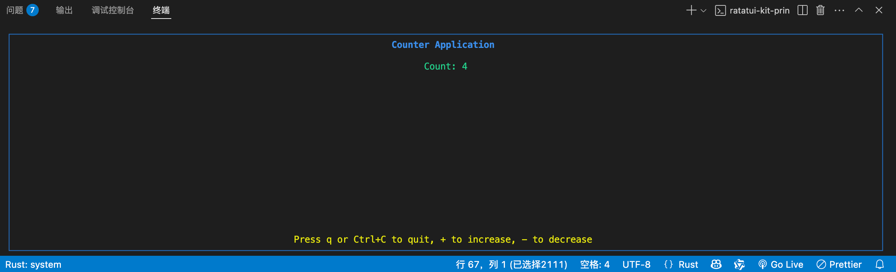

## 前言

本系列文章旨在系统梳理 [`ratatui-kit`](https://github.com/yexiyue/ratatui-kit) 的核心实现原理。`ratatui-kit` 是一个基于 [ratatui](https://ratatui.rs/) 的终端 UI 框架，融合了 [iocraft](https://github.com/ccbrown/iocraft) 的优秀实践，并借鉴了 React 的声明式、组件化开发范式，致力于让开发者能够像写前端一样优雅地构建终端用户界面（TUI）应用。

在深入研究 `iocraft` 源码的过程中，我对状态管理、渲染机制和抽象设计有了更深刻的理解。撰写本系列的初衷有二：一是自我总结与梳理，二是希望帮助更多开发者了解并应用 `ratatui-kit`，推动其持续演进。

终端 UI 的开发，最核心的环节就是“渲染循环”。它类似于 Web 前端的渲染线程，负责事件处理与界面更新，是一切交互的基础。因此，本系列将以渲染循环为切入点，逐步剖析组件系统、Hook 机制、元素与属性模型、终端事件处理等关键模块，带你理解 `ratatui-kit` 的设计思想与实现细节。

我们不会闭门造轮子，而是从一个标准的 `ratatui` 示例程序出发，逐步重构并演进出一个具备 React 风格的 TUI 框架，帮助你在实际项目中灵活应用这些理念。

---

### 从零开始：一个最小可用的 `ratatui` Demo

首先，让我们从一个最基础的计数器 Demo 程序出发，体验原生 `ratatui` 的开发方式，并为后续的重构埋下伏笔。

#### 依赖安装

```toml
[dependencies]
crossterm = { version = "0.29.0", features = ["event-stream"] }
futures = "0.3.31"
ratatui = "0.29.0"
tokio = { version = "1.45.1", features = ["full"] }
```

#### 主程序代码

```rust
use crossterm::event::{Event, EventStream, KeyCode, KeyModifiers};
use futures::StreamExt;
use ratatui::{
    layout::{Constraint, Layout},
    style::{Style, Stylize},
    text::Line,
    widgets::{Block, Borders, Paragraph},
};
use std::io;

#[tokio::main]
async fn main() -> io::Result<()> {
    let mut terminal = ratatui::init();
    let mut event_stream = EventStream::new();
    let mut count = 0;

    loop {
        terminal.draw(|f| {
            let area = f.area();

            let block = Block::default()
                .borders(Borders::ALL)
                .border_style(Style::default().blue());

            let inner_area = block.inner(area);

            let title = Line::from("Counter Application")
                .style(Style::default().bold().light_blue())
                .centered();

            let text = Paragraph::new(format!("Count: {}", count).light_green()).centered();

            let info = Line::from("Press q or Ctrl+C to quit, + to increase, - to decrease")
                .style(Style::default().yellow())
                .centered();

            let [top, body, bottom] = Layout::vertical([
                Constraint::Length(1),
                Constraint::Fill(1),
                Constraint::Length(1),
            ])
            .spacing(1)
            .areas(inner_area);
            f.render_widget(block, area);
            f.render_widget(title, top);
            f.render_widget(text, body);
            f.render_widget(info, bottom);
        })?;

        if let Some(Ok(event)) = event_stream.next().await {
            if let Event::Key(key) = event {
                match key.code {
                    KeyCode::Char('q') => break,
                    KeyCode::Char('+') => count += 1,
                    KeyCode::Char('-') => count -= 1,
                    KeyCode::Left => count -= 1,
                    KeyCode::Right => count += 1,
                    KeyCode::Char('c') if key.modifiers.contains(KeyModifiers::CONTROL) => break,
                    _ => {}
                }
            }
        }
    }
    ratatui::restore();
    Ok(())
}
```

#### 运行效果

```shell
cargo run
```



---

### 解析：渲染循环与事件驱动

这个 Demo 展示了最基础的 TUI 计数器应用，其核心流程如下：

1. 初始化终端和事件流。
2. 进入主循环：
    - 渲染 UI（`terminal.draw`）。
    - 监听并处理用户输入事件（`event_stream.next().await`）。
    - 根据事件更新状态（如 `count` 变量）。
    - 状态变化后自动触发下一帧渲染。
3. 退出时恢复终端。

这种主循环模式，就是典型的“渲染循环”——每一帧都根据最新状态渲染 UI，并响应用户输入驱动状态变化。它与 Web 前端的“事件驱动 + 状态驱动渲染”模式高度相似。

> **思考：** 这种写法虽然简单直观，但如果 UI 结构变复杂、需要组件复用、状态管理、生命周期钩子等特性，所有逻辑都堆在主循环里会变得难以维护。

因此，下一步我们将尝试将 UI 结构和状态管理解耦，引入“组件化”思想，为后续的高阶抽象打下基础。
