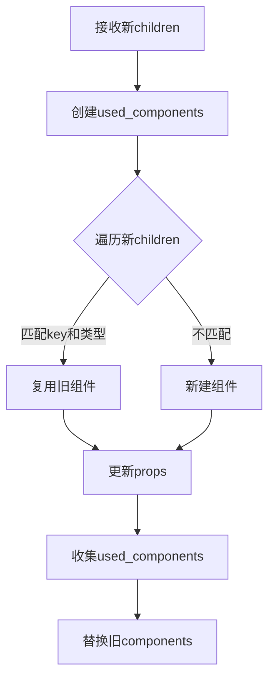

## 组件更新

上一节我们介绍了 Ratatui Kit 的自动布局和递归渲染机制。本节将进一步探讨组件的动态更新原理，包括节点唯一标识、组件实例化简化、更新辅助工具的设计，以及高效的组件复用与最小化重建流程。

### 1. 节点唯一标识（ElementKey）

在组件化 UI 框架中，组件树的每个节点都需要一个唯一的 key。这样，组件树结构发生变化时，框架才能准确地定位、复用和管理每个组件实例。

#### 1.1 设计思路

- 每个组件分配唯一 ID。
- 支持任意可哈希类型作为 key。
- 便于后续组件复用与高效查找。

#### 1.2 代码实现

首先安装 `any_key` 依赖：

```bash
cargo add any_key
```

核心实现如下：

```rust
use any_key::AnyHash;
use std::{fmt::Debug, hash::Hash, sync::Arc};

/// ElementKey：唯一标识组件树节点，支持任意可哈希类型
#[derive(Clone, PartialEq, Eq, Hash, Debug)]
pub struct ElementKey(Arc<Box<dyn AnyHash + Send + Sync>>);

impl ElementKey {
    /// 创建新的 ElementKey
    pub fn new<T>(value: T) -> Self
    where
        T: Debug + Send + Sync + AnyHash,
    {
        Self(Arc::new(Box::new(value)))
    }
}
```

在组件实例结构体中添加 key 字段，实例化时传入：

```rust
pub struct InstantiatedComponent {
    key: ElementKey,
    component: Box<dyn AnyComponent>,
    children: Components,
    helper: Box<dyn ComponentHelperExt>,
    layout_style: LayoutStyle,
}

impl InstantiatedComponent {
    pub fn new(key: ElementKey, mut props: AnyProps, helper: Box<dyn ComponentHelperExt>) -> Self {
        let component = helper.new_component(props.borrow());

        Self {
            key,
            component,
            helper,
            children: Components::default(),
            layout_style: LayoutStyle::default(),
            hooks: Default::default(),
        }
    }
    // ...
}
```

### 2. 简化组件实例化（Element 与 AnyElement）

传统的组件实例化方式较为繁琐，需要手动传递多项参数。为提升开发体验，我们引入了 `Element` 结构体，将 key、props 和类型信息封装在一起，实现更简洁的声明方式。

```rust
use crate::props::AnyProps;
pub mod key;
use key::ElementKey;

pub struct Element<'a> {
    pub key: ElementKey,
    pub props: AnyProps<'a>,
}
```

为保证类型安全和泛型能力，引入 `ElementType` trait：

```rust
pub mod key;
use crate::component::Component;
use key::ElementKey;

/// ElementType trait：为每种组件类型定义 Props 类型，便于泛型处理
pub trait ElementType {
    type Props<'a>
    where
        Self: 'a;
}

impl<C> ElementType for C
where
    C: Component,
{
    type Props<'a> = C::Props<'a>;
}

pub struct Element<'a, T: ElementType + 'a> {
    pub key: ElementKey,
    pub props: T::Props<'a>,
}
```

类型擦除层 `AnyElement` 用于统一管理不同类型组件：

```rust
use crate::{
    component::{
        Component,
        component_helper::{ComponentHelper, ComponentHelperExt},
    },
    element::{Element, key::ElementKey},
    props::AnyProps,
};

pub struct AnyElement<'a> {
    key: ElementKey,
    props: AnyProps<'a>,
    helper: Box<dyn ComponentHelperExt>,
}

impl<'a, T> From<Element<'a, T>> for AnyElement<'a>
where
    T: Component,
{
    fn from(value: Element<'a, T>) -> Self {
        Self {
            key: value.key,
            props: AnyProps::owned(value.props),
            helper: ComponentHelper::<T>::boxed(),
        }
    }
}

impl<'a, 'b: 'a, T> From<&'a mut Element<'b, T>> for AnyElement<'a>
where
    T: Component,
{
    fn from(value: &'a mut Element<'b, T>) -> Self {
        Self {
            key: value.key.clone(),
            props: AnyProps::borrowed(&mut value.props),
            helper: ComponentHelper::<T>::boxed(),
        }
    }
}

impl<'a, 'b: 'a> From<&'a mut AnyElement<'b>> for AnyElement<'b> {
    fn from(value: &'a mut AnyElement<'b>) -> Self {
        Self {
            key: value.key.clone(),
            props: value.props.borrow(),
            helper: value.helper.copy(),
        }
    }
}
```

### 3. 组件更新辅助工具（ComponentUpdater）

组件类型与实例分离，trait 无法直接访问实例相关信息。为此，我们设计了 `ComponentUpdater`，专门辅助组件的更新和属性变更。

```rust
use crate::{
    component::instantiated_component::Components, element::key::ElementKey,
    render::layout_style::LayoutStyle,
};

pub struct ComponentUpdater<'a> {
    key: ElementKey,
    components: &'a mut Components,
    layout_style: &'a mut LayoutStyle,
}

impl<'a> ComponentUpdater<'a> {
    pub fn new(
        key: ElementKey,
        components: &'a mut Components,
        layout_style: &'a mut LayoutStyle,
    ) -> Self {
        Self {
            key,
            components,
            layout_style,
        }
    }

    pub fn set_layout_style(&mut self, layout_style: LayoutStyle) {
        *self.layout_style = layout_style;
    }
}
```

### 4. 组件更新方法定义

在 `Component` trait 中添加 `update` 方法，参数为 `ComponentUpdater`，以支持自定义组件的更新逻辑。

```rust
pub trait Component: Any {
    type Props<'a>
    where
        Self: 'a;
    // ...
    
    fn update(&mut self, props: &mut Self::Props<'_>, updater: &mut ComponentUpdater<'_>) {}
}
```

类型擦除层也需支持 update：

```rust
pub trait AnyComponent {
    // ...

    fn update(&mut self, props: AnyProps, updater: &mut ComponentUpdater<'_>);
}

impl<T> AnyComponent for T
where
    T: Component,
{
    // ...

    fn update(&mut self, mut props: AnyProps, updater: &mut ComponentUpdater<'_>) {
        Component::update(self, unsafe { props.downcast_mut_unchecked() }, updater);
    }
}
```

`ComponentHelperExt` trait 增加统一的更新方法：

```rust
use std::any::TypeId;
use crate::{
    component::{AnyComponent, Component},
    props::AnyProps,
    render::updater::ComponentUpdater,
};

pub trait ComponentHelperExt {
    // ...

    fn update_component(
        &self,
        component: &mut Box<dyn AnyComponent>,
        props: AnyProps,
        updater: &mut ComponentUpdater,
    );

    fn component_type_id(&self) -> TypeId;
}

// ...

impl<T> ComponentHelperExt for ComponentHelper<T>
where
    T: Component,
{
    // ...

    fn update_component(
        &self,
        component: &mut Box<dyn AnyComponent>,
        props: AnyProps,
        updater: &mut ComponentUpdater,
    ) {
        component.update(props, updater);
    }

    fn component_type_id(&self) -> TypeId {
        TypeId::of::<T>()
    }
}
```

### 5. 组件实例的高效更新

组件实例实现 update 方法，利用 updater 完成更新：

```rust
impl InstantiatedComponent {
    // ...
   
    fn update(&mut self, props: AnyProps) {
        let mut updater =
            ComponentUpdater::new(self.key.clone(), &mut self.children, &mut self.layout_style);

        self.helper
            .update_component(&mut self.component, props, &mut updater);
    }

    // 返回组件
    fn component(&self) -> &dyn AnyComponent {
        &*self.component
    }
}
```

### 6. 组件集合的优化存储

为支持高效查找和复用，`Components` 由数组改为映射，key 为 `ElementKey`。

```rust
use std::{
    collections::{HashMap, VecDeque},
    hash::Hash,
};

/// AppendOnlyMultimap 是一个多值映射，允许向末尾追加值。
/// 它的主要特点是只支持追加操作，不支持删除操作。
pub(crate) struct AppendOnlyMultimap<K, V> {
    items: Vec<Option<V>>,          // 存储所有值的容器
    m: HashMap<K, VecDeque<usize>>, // 键到索引的映射
}

impl<K, V> Default for AppendOnlyMultimap<K, V> {
    fn default() -> Self {
        Self {
            items: Vec::new(),
            m: HashMap::new(),
        }
    }
}

impl<K, V> AppendOnlyMultimap<K, V>
where
    K: Eq + Hash,
{
    /// 向 multimap 末尾追加一个值，关联到指定的键。
    pub fn push_back(&mut self, key: K, value: V) {
        let index = self.items.len();
        self.items.push(Some(value));
        self.m.entry(key).or_default().push_back(index);
    }
}

/// RemoveOnlyMultimap 是一个多值映射，允许从前面移除值。
/// 它的主要特点是只支持删除操作，不支持追加操作。
pub struct RemoveOnlyMultimap<K, V> {
    items: Vec<Option<V>>,          // 存储所有值的容器
    m: HashMap<K, VecDeque<usize>>, // 键到索引的映射
}

impl<K, V> Default for RemoveOnlyMultimap<K, V> {
    fn default() -> Self {
        Self {
            items: Vec::new(),
            m: HashMap::new(),
        }
    }
}

impl<K, V> From<AppendOnlyMultimap<K, V>> for RemoveOnlyMultimap<K, V>
where
    K: Eq + Hash,
{
    fn from(value: AppendOnlyMultimap<K, V>) -> Self {
        Self {
            items: value.items,
            m: value.m,
        }
    }
}

impl<K, V> RemoveOnlyMultimap<K, V>
where
    K: Eq + Hash,
{
    /// 从 multimap 中移除与指定键关联的第一个值。
    pub fn pop_front(&mut self, key: &K) -> Option<V> {
        let index = self.m.get_mut(key)?.pop_front()?;
        self.items[index].take()
    }

    /// 遍历 multimap 中的所有值。
    pub fn iter(&self) -> impl Iterator<Item = &V> {
        self.items.iter().filter_map(|item| item.as_ref())
    }

    /// 遍历 multimap 中的所有值（可变引用）。
    pub fn iter_mut(&mut self) -> impl Iterator<Item = &mut V> {
        self.items.iter_mut().filter_map(|item| item.as_mut())
    }
}
```

组件集合结构体定义：

```rust
pub struct Components {
    pub components: RemoveOnlyMultimap<ElementKey, InstantiatedComponent>,
}
```

### 7. 子组件的高效复用与最小化重建

组件更新的核心流程如下：



实现代码：

```rust
impl<'a> ComponentUpdater<'a> {

    /// 根据传入的 children 列表，更新当前组件的所有子组件。
    ///
    /// 算法说明：
    /// 1. 遍历新的 children（每个 AnyElement），尝试用 key 从旧组件映射中取出对应的 InstantiatedComponent。
    /// 2. 如果 key 匹配且类型一致，则复用旧组件实例，否则新建一个组件实例。
    /// 3. 对每个组件实例调用 update，传入新的 props。
    /// 4. 将本轮用到的组件按顺序插入新的 multimap，最后整体替换原有的 components。
    ///
    /// 这样可以保证：
    /// - 组件 key 不变且类型一致时，组件实例被复用，保留内部状态。
    /// - key 变更或类型不一致时，自动销毁旧实例并新建，保证类型安全。
    /// - 未被复用的旧组件会被丢弃，实现“最小化重建”。
    pub fn update_children<T>(&mut self, children: T)
    where
        T: IntoIterator<Item = AnyElement<'a>>,
    {
        // 新建一个 multimap，用于存放本轮更新后实际用到的组件实例
        let mut used_compoent = AppendOnlyMultimap::default();

        // 遍历新的 children 列表
        for mut child in children {
            // 尝试用 key 从旧组件集合中取出一个实例
            let mut component = match self.components.pop_front(&child.key) {
                // 如果 key 匹配且类型一致，则复用旧组件实例
                Some(component)
                    if component.component().type_id() == child.helper.component_type_id() =>
                {
                    component
                }
                // 否则新建一个组件实例
                _ => {
                    let h = child.helper.copy();
                    InstantiatedComponent::new(child.key.clone(), child.props.borrow(), h)
                }
            };

            // 用新的 props 更新组件实例
            component.update(child.props.borrow());
            // 将本轮用到的组件实例插入 multimap
            used_compoent.push_back(child.key.clone(), component);
        }

        // 用新的 multimap 替换原有的 components，实现“最小化重建”
        self.components.components = used_compoent.into();
    }
}
```

> **说明：** 为了获取 AnyComponent 的 type_id，需要为 `AnyComponent` trait 添加 `Any` 约束：

```rust
pub trait AnyComponent: Any {
    // ...
}
```

通过上述设计，组件的状态复用、最小化重建都能高效实现，为终端 UI 框架的动态能力提供了坚实基础。

### 8. 统一的渲染主循环入口

在实际开发中，我们希望直接用 Element 这样的声明式结构描述 UI，然后一行代码就能启动渲染主循环，而不是手动实例化组件。为此，可以给 Element 扩展一个 trait（ElementExt），让它支持统一的“渲染主循环”接口。这样无论是 Element 还是 AnyElement，都能直接调用 render_loop，自动完成组件树的构建和渲染。

下面是 ElementExt trait 的定义和实现：

```rust
// Element 扩展 trait 及相关工具，便于统一操作不同类型的 Element
use super::ElementKey;
use crate::{component::component_helper::ComponentHelperExt, props::AnyProps};
use std::io;

/// 私有模块，用于实现 trait 封装，防止外部实现 ElementExt
mod private {
    use crate::{
        component::Component,
        element::{AnyElement, Element},
    };

    /// Sealed trait，防止外部实现 ElementExt
    pub trait Sealed {}

    // 为 AnyElement 及其可变引用实现 Sealed
    impl<'a> Sealed for AnyElement<'a> {}
    impl<'a> Sealed for &mut AnyElement<'a> {}

    // 为泛型 Element 及其可变引用实现 Sealed
    impl<'a, T> Sealed for Element<'a, T> where T: Component {}
    impl<'a, T> Sealed for &mut Element<'a, T> where T: Component {}
}

/// ElementExt trait：为 Element/AnyElement 提供统一的扩展方法
pub trait ElementExt: private::Sealed + Sized {
    /// 获取节点唯一 key
    fn key(&self) -> &ElementKey;
    /// 获取可变 props（类型擦除）
    fn props_mut(&mut self) -> AnyProps;
    /// 获取组件 helper
    fn helper(&self) -> Box<dyn ComponentHelperExt>;

    /// 启动渲染主循环
    fn render_loop(&mut self) -> impl Future<Output = io::Result<()>>;
}
```

有了 ElementExt 之后，更新子组件时也可以用统一的 trait 处理不同类型的 Element，代码更简洁：

```rust
pub fn update_children<T, E>(&mut self, children: T)
where
    T: IntoIterator<Item = E>,
    E: ElementExt,
{
    // 新建一个 multimap，用于存放本轮更新后实际用到的组件实例
    let mut used_compoent = AppendOnlyMultimap::default();

    // 遍历新的 children 列表
    for mut child in children {
        // 尝试用 key 从旧组件集合中取出一个实例
        let mut component = match self.components.pop_front(&child.key()) {
            // 如果 key 匹配且类型一致，则复用旧组件实例
            Some(component)
                if component.component().type_id() == child.helper().component_type_id() =>
            {
                component
            }
            // 否则新建一个组件实例
            _ => {
                let h = child.helper().copy();
                InstantiatedComponent::new(child.key().clone(), child.props_mut(), h)
            }
        };

        // 用新的 props 更新组件实例
        component.update(child.props_mut());
        // 将本轮用到的组件实例插入 multimap
        used_compoent.push_back(child.key().clone(), component);
    }

    // 用新的 multimap 替换原有的 components，实现“最小化重建”
    self.components.components = used_compoent.into();
}
```

Tree 结构体新增 props 属性，并在渲染前自动调用 update 方法，保证每次渲染前都能同步最新的 props。

```rust
pub struct Tree<'a> {
    root_component: InstantiatedComponent,
    props: AnyProps<'a>,
}

impl<'a> Tree<'a> {
    pub fn new(mut props: AnyProps<'a>, helper: Box<dyn ComponentHelperExt>) -> Self {
        Self {
            root_component: InstantiatedComponent::new(
                ElementKey::new("__root__"),
                props.borrow(),
                helper,
            ),
            props,
        }
    }

    pub fn render(&mut self, terminal: &mut ratatui::DefaultTerminal) -> io::Result<()> {
        self.root_component.update(self.props.borrow());

        terminal.draw(|frame| {
            let area = frame.area();
            let mut drawer = ComponentDrawer::new(frame, area);
            self.root_component.draw(&mut drawer);
        })?;

        Ok(())
    }

    pub async fn render_loop(&mut self) -> io::Result<()> {
        let mut terminal = ratatui::init();
        let mut event_stream = EventStream::new();
        loop {
            self.render(&mut terminal)?;

            if let Some(Ok(event)) = event_stream.next().await {
                if let Event::Key(key) = event {
                    match key.code {
                        KeyCode::Char('q') => break,
                        KeyCode::Char('c') if key.modifiers.contains(KeyModifiers::CONTROL) => {
                            break;
                        }
                        _ => {}
                    }
                }
            }
        }
        ratatui::restore();
        Ok(())
    }
}
```

我们还可以在 tree.rs 里加一个通用的渲染函数，方便所有实现了 ElementExt 的类型直接启动主循环：

```rust
pub(crate) async fn render_loop<E: ElementExt>(mut element: E) -> io::Result<()> {
    let helper = element.helper();
    let mut tree = Tree::new(element.props_mut(), helper);

    tree.render_loop().await?;
    Ok(())
}
```

最后，为 Element 及其可变引用实现 ElementExt trait，这样就能直接用 Element 启动渲染循环了：

```rust
impl<'a, T> ElementExt for Element<'a, T>
where
    T: Component,
{
    fn key(&self) -> &ElementKey {
        &self.key
    }

    fn helper(&self) -> Box<dyn ComponentHelperExt> {
        ComponentHelper::<T>::boxed()
    }

    fn props_mut(&mut self) -> AnyProps {
        AnyProps::borrowed(&mut self.props)
    }

    async fn render_loop(&mut self) -> io::Result<()> {
        render_loop(self).await?;
        Ok(())
    }
}

impl<'a, T> ElementExt for &mut Element<'a, T>
where
    T: Component,
{
    fn key(&self) -> &ElementKey {
        &self.key
    }

    fn helper(&self) -> Box<dyn ComponentHelperExt> {
        ComponentHelper::<T>::boxed()
    }

    fn props_mut(&mut self) -> AnyProps {
        AnyProps::borrowed(&mut self.props)
    }

    async fn render_loop(&mut self) -> io::Result<()> {
        render_loop(&mut **self).await?;
        Ok(())
    }
}
```

同理，AnyElement 也可以实现 ElementExt，具体实现和 Element 类似，这里就不赘述了。

通过这种方式，我们把组件实例的中间层封装了起来。开发者只需要声明 UI 结构，直接调用 render_loop 就能启动完整的渲染和事件循环，极大提升了易用性和扩展性。

### 9. 修改之前的案例

添加`View`组件：

```rust
#[derive(Default)]
pub struct ViewProps<'a> {
    /// 主轴方向（横向/纵向）
    pub flex_direction: Direction,
    /// 主轴对齐方式（如 Start, End, Center, SpaceBetween 等）
    pub justify_content: Flex,
    /// 子项间距
    pub gap: i32,
    /// 外边距
    pub margin: Margin,
    /// 偏移量
    pub offset: Offset,
    /// 宽度约束
    pub width: Constraint,
    /// 高度约束
    pub height: Constraint,

    pub children: Vec<AnyElement<'a>>,
}

pub struct View;

impl Component for View {
    type Props<'a> = ViewProps<'a>;

    fn new(_props: &Self::Props<'_>) -> Self {
        Self
    }

    fn update(
        &mut self,
        props: &mut Self::Props<'_>,
        updater: &mut ratatui_kit_principle::render::updater::ComponentUpdater<'_>,
    ) {
        updater.set_layout_style(LayoutStyle {
            flex_direction: props.flex_direction,
            justify_content: props.justify_content,
            gap: props.gap,
            margin: props.margin,
            offset: props.offset,
            width: props.width,
            height: props.height,
        });

        updater.update_children(props.children.iter_mut());
    }
}
```

修改main函数

```rust
#[tokio::main]
async fn main() -> io::Result<()> {
    let count = 0;

    let counter_text = format!("Count: {}", count);

    let mut element = Element::<View> {
        key: ElementKey::new("root"),
        props: ViewProps {
            children: vec![
                Element::<View> {
                    key: ElementKey::new("header"),
                    props: ViewProps {
                        children: vec![
                            Element::<Text> {
                                key: ElementKey::new("title"),
                                props: TextProps {
                                    text: "Welcome to the Counter App",
                                    style: Style::default().bold().light_blue(),
                                    alignment: ratatui::layout::Alignment::Center,
                                },
                            }
                            .into(),
                        ],
                        height: Constraint::Length(1),
                        ..Default::default()
                    },
                }
                .into(),
                Element::<View> {
                    key: ElementKey::new("body"),
                    props: ViewProps {
                        children: vec![
                            Element::<Text> {
                                key: ElementKey::new("number"),
                                props: TextProps {
                                    text: counter_text.as_str(),
                                    style: Style::default().light_green(),
                                    alignment: ratatui::layout::Alignment::Center,
                                },
                            }
                            .into(),
                        ],
                        height: Constraint::Fill(1),
                        ..Default::default()
                    },
                }
                .into(),
                Element::<View> {
                    key: ElementKey::new("footer"),
                    props: ViewProps {
                        children: vec![
                            Element::<Text> {
                                key: ElementKey::new("info"),
                                props: TextProps {
                                    text: "Press q or Ctrl+C to quit, + to increase, - to decrease",
                                    style: Style::default().yellow(),
                                    alignment: ratatui::layout::Alignment::Center,
                                },
                            }
                            .into(),
                        ],
                        height: Constraint::Length(1),
                        ..Default::default()
                    },
                }
                .into(),
            ],
            flex_direction: Direction::Vertical,
            gap: 3,
            ..Default::default()
        },
    };

    element.render_loop().await?;
    Ok(())
}
```

可以看到，整个 UI 结构就是一棵嵌套的 Element 树。每个区域（header、body、footer）都是一个 View，里面再嵌套 Text 组件。所有布局和样式都通过 props 直接声明，结构一目了然。

运行后效果如下：


---

**练习：**

请你尝试用同样的方式，基于新的 Element 体系，改写 Border 组件。要求：

- Border 组件依然支持设置边框样式（如颜色、粗细等），并能包裹任意子组件。
- 用 Element 声明 Border 组件的使用方式，保持和之前案例一致。
- 让 Border 组件的渲染效果和之前保持一致。

你可以参考 View 组件的写法，思考如何把边框样式、子组件等信息通过 props 传递，并在 update 和 draw 方法中实现对应的逻辑。

通过这个练习，你将进一步掌握如何用统一的 Element 体系灵活组合和扩展自定义组件。

### 总结

本节详细介绍了 Ratatui Kit 的组件更新机制，包括节点唯一标识、组件实例化简化、组件复用与最小化重建，以及统一的 Element 渲染主循环。通过 View 组件和新的 Element 体系，UI 结构声明和组件组合都变得更加清晰和灵活。这些设计让终端 UI 的开发体验大幅提升，也为后续实现更复杂的状态管理和交互能力打下了坚实基础。

下一步，我们将引入 Hook 系统，进一步完善组件的状态管理和响应机制，让你的终端 UI 也能拥有类似 React 的响应式开发体验，敬请期待。
