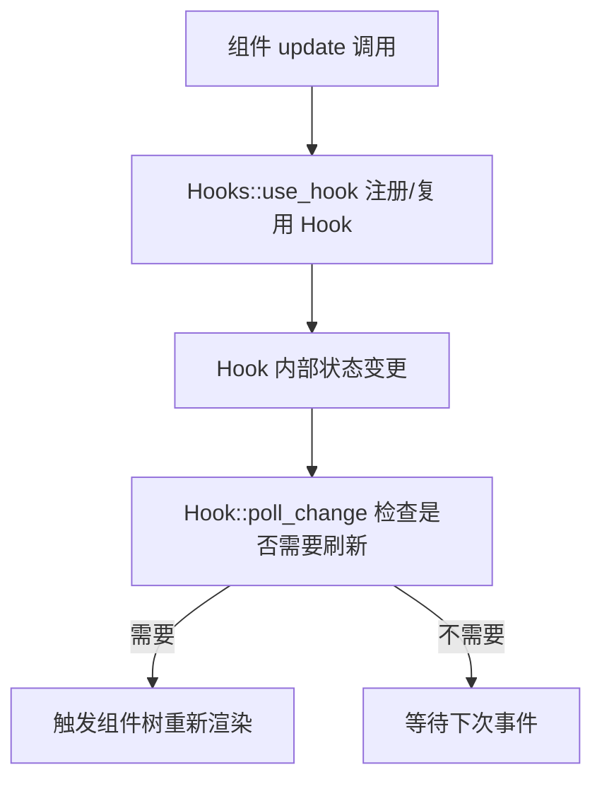

## Hook 系统

上一节我们已经打通了组件的高效更新和复用机制，这一节要聊的 Hook 系统，就是后续实现组件状态管理的基础。只有有了 Hook，组件才能优雅地保存和响应自己的状态变化。

### 1. Hook 的核心思路

在终端 UI 里，事件循环一般长这样：

```rust
loop {
    self.render(&mut terminal)?;
    if let Some(Ok(event)) = event_stream.next().await {
        // ...处理事件...
    }
}
```

每次有事件发生，都会触发组件树的更新。Hook 的本质，就是在组件更新时，自动保存和复用你的状态、逻辑和副作用。你可以把 Hook 理解为“组件生命周期里的小状态机”，每次渲染时被轮询（poll），只要有变化就驱动 UI 更新。

### 2. Hook trait 的定义

所有自定义 Hook 都要实现 Hook trait。它支持异步轮询和一组扩展钩子，便于在组件更新和绘制前后做副作用处理：

```rust
use std::{
    pin::Pin,
    task::{Context, Poll},
};

// Hook trait：所有 Hook 类型的基础接口，支持异步轮询
pub trait Hook: Unpin + Send {
    // 轮询 Hook 是否有变化，默认返回 Pending
    fn poll_change(self: Pin<&mut Self>, _cx: &mut Context) -> Poll<()> {
        Poll::Pending
    }

    // 组件更新前的钩子，可用于副作用处理
    fn pre_component_update(&mut self, _updater: &mut ComponentUpdater) {}
    // 组件更新后的钩子
    fn post_component_update(&mut self, _updater: &mut ComponentUpdater) {}

    // 组件绘制前的钩子
    fn pre_component_draw(&mut self, _drawer: &mut ComponentDrawer) {}
    // 组件绘制后的钩子
    fn post_component_draw(&mut self, _drawer: &mut ComponentDrawer) {}
}
```

这样，每个 Hook 都可以被异步地“唤醒”，在需要时触发组件更新。

### 3. 类型擦除与 AnyHook

Rust 的 trait 对象不能直接 downcast。我们用 AnyHook trait 做一层类型擦除，方便后续统一管理和类型转换：

```rust
pub trait AnyHook: Hook {
    fn any_self_mut(&mut self) -> &mut dyn Any;
}

impl<T: Hook + 'static> AnyHook for T {
    fn any_self_mut(&mut self) -> &mut dyn Any {
        self
    }
}
```

#### Hook 列表的批量管理

实际开发中，组件通常会有多个 Hook。我们可以直接为 `Vec<Box<dyn AnyHook>>` 实现 Hook trait，这样就能统一批量管理所有 Hook 的状态和副作用：

```rust
// 为 Hook 列表实现 Hook trait，便于批量管理和轮询所有 Hook
impl Hook for Vec<Box<dyn AnyHook>> {
    fn poll_change(mut self: Pin<&mut Self>, cx: &mut Context) -> Poll<()> {
        let mut is_ready = false;

        // 遍历所有 Hook，只要有一个就绪则返回 Ready
        for hook in self.iter_mut() {
            if Pin::new(&mut **hook).poll_change(cx).is_ready() {
                is_ready = true;
            }
        }

        if is_ready {
            Poll::Ready(())
        } else {
            Poll::Pending
        }
    }

    fn pre_component_update(&mut self, _updater: &mut ComponentUpdater) {
        for hook in self.iter_mut() {
            hook.pre_component_update(_updater);
        }
    }

    fn post_component_update(&mut self, _updater: &mut ComponentUpdater) {
        for hook in self.iter_mut() {
            hook.post_component_update(_updater);
        }
    }

    fn pre_component_draw(&mut self, _updater: &mut ComponentDrawer) {
        for hook in self.iter_mut() {
            hook.pre_component_draw(_updater);
        }
    }

    fn post_component_draw(&mut self, _updater: &mut ComponentDrawer) {
        for hook in self.iter_mut() {
            hook.post_component_draw(_updater);
        }
    }
}
```

这样，组件只需维护一个 Hook 列表，就能统一管理所有 Hook 的状态和副作用。

### 4. Hooks 结构体：集中管理每个组件的 Hook

每个组件实例都维护一个 Hooks 结构体，专门用来存放和管理所有 Hook 实例。这样可以保证每次渲染时，Hook 的顺序和类型都一致。

```rust
pub struct Hooks<'a> {
    hooks: &'a mut Vec<Box<dyn AnyHook>>,
    first_update: bool,
    hook_index: usize,
}

impl<'a> Hooks<'a> {
    pub fn new(hooks: &'a mut Vec<Box<dyn AnyHook>>, first_update: bool) -> Self {
        Self {
            hooks,
            first_update,
            hook_index: 0,
        }
    }

    pub fn use_hook<F, H>(&mut self, f: F) -> &mut H
    where
        F: FnOnce() -> H,
        H: Hook + 'static,
    {
        if self.first_update {
            self.hooks.push(Box::new(f()));
        }
        let idx = self.hook_index;
        self.hook_index += 1;
        self.hooks
            .get_mut(idx)
            .and_then(|hook| hook.any_self_mut().downcast_mut::<H>())
            .expect("Hook type mismatch, ensure the hook is of the correct type")
    }
}
```

每次组件 update 时，Hooks 会自动复用已有的 Hook 实例，保证状态不丢失。

### 5. Hook 与组件更新的结合

组件的 `update` 方法现在会接收一个 Hooks 结构体参数。你可以在 update 里通过 Hooks 来声明和使用各种 Hook，实现状态管理和副作用逻辑。这样，Hook 系统就能随着组件的更新流程自动工作，实现响应式的 UI 行为。

```rust
fn update(
    &mut self,
    _props: &mut Self::Props<'_>,
    _hooks: Hooks,
    _updater: &mut ComponentUpdater<'_>,
) {
}
```

`AnyComponent` trait 的 `update` 方法同理也需要接受一个 `Hooks` 参数。

组件实例（InstantiatedComponent）需要有 hooks 和 first_update 字段，分别用于存储当前组件的 Hook 列表和是否是第一次更新。每次 update 时，Hooks::new 会自动管理 Hook 的创建和复用。

在组件的 update 和 draw 方法中，也要分别调用 Hook 的相关钩子，保证副作用和状态同步：

```rust
/// 更新当前组件及其子组件的状态，驱动 Hook 生命周期和属性变更
pub fn update(&mut self, props: AnyProps) {
    // 构造组件更新辅助器，便于管理子组件和布局
    let mut updater =
        ComponentUpdater::new(self.key.clone(), &mut self.children, &mut self.layout_style);

    // 更新前调用所有 Hook 的 pre_component_update 钩子
    self.hooks.pre_component_update(&mut updater);

    // 构造 Hooks 管理器，驱动本次 update 的所有 Hook 生命周期
    let hooks = Hooks::new(&mut self.hooks, self.first_update);

    // 调用组件的 update_component 方法，传递 props、hooks、updater
    self.helper
        .update_component(&mut self.component, props, hooks, &mut updater);

    // 更新后调用所有 Hook 的 post_component_update 钩子
    self.hooks.post_component_update(&mut updater);

    // 首次 update 标记为 false，后续渲染复用 Hook
    self.first_update = false;
}

/// 递归渲染当前组件及其所有子组件，自动处理布局和 Hook 生命周期
pub fn draw(&mut self, drawer: &mut ComponentDrawer) {
    let layout_style = &self.layout_style;

    // 1. 计算应用 margin/offset 后的实际区域
    let area = layout_style.inner_area(drawer.area);
    drawer.area = area;
    // 渲染前调用所有 Hook 的 pre_component_draw 钩子
    self.hooks.pre_component_draw(drawer);
    // 2. 绘制当前组件内容
    self.component.draw(drawer);

    // 3. 计算所有子组件的区域划分（支持嵌套布局）
    let children_areas =
        self.component
            .calc_children_areas(&self.children, layout_style, drawer);

    // 4. 递归渲染所有子组件，每个子组件分配独立的区域
    for (child, child_area) in self.children.iter_mut().zip(children_areas) {
        drawer.area = child_area;
        child.draw(drawer);
    }
    // 渲染后调用所有 Hook 的 post_component_draw 钩子
    self.hooks.post_component_draw(drawer);
}
```

### 6. Hook 系统与渲染循环的结合

为了让 Hook 真正驱动 UI 响应式刷新，我们还需要让组件树能“感知”到 Hook 的状态变化。为此，InstantiatedComponent 和 Components 都实现了 poll_change 方法，用于递归轮询自身和所有子组件的状态变化：

```rust
impl InstantiatedComponent {
    // ...

    /// 递归检查当前组件及其所有 Hook、子组件是否有状态变更需要刷新
    pub fn poll_change(mut self: Pin<&mut Self>, cx: &mut Context) -> Poll<()> {
        // 先检查自身 hooks 是否有变化
        let hooks_status = Pin::new(&mut self.hooks).poll_change(cx);
        // 再检查所有子组件是否有变化
        let children_status = Pin::new(&mut self.children).poll_change(cx);

        // 只要有一个就绪，则整个组件需要刷新
        if hooks_status.is_ready() || children_status.is_ready() {
            Poll::Ready(())
        } else {
            Poll::Pending
        }
    }

    /// 异步等待，直到当前组件或其子组件有状态变更（常用于事件驱动的刷新）
    pub async fn wait(&mut self) {
        let mut self_mut = Pin::new(self);
        poll_fn(move |cx| self_mut.as_mut().poll_change(cx)).await;
    }
}

impl Components {
    // ...

    pub fn poll_change(mut self: Pin<&mut Self>, cx: &mut Context) -> Poll<()> {
        let mut is_ready = false;

        for component in self.components.iter_mut() {
            if Pin::new(component).poll_change(cx).is_ready() {
                is_ready = true;
            }
        }

        if is_ready {
            Poll::Ready(())
        } else {
            Poll::Pending
        }
    }
}
```

这样，组件树就能自动感知到 Hook 或子组件的状态变更。

Tree 的渲染主循环也要配合 Hook 系统，每次渲染后等待组件树有状态变更再刷新，避免无效重绘：

```rust
impl<'a> Tree<'a> {
    // ...

    pub async fn render_loop(&mut self) -> io::Result<()> {
        let mut terminal = ratatui::init();
        let mut event_stream = EventStream::new();
        loop {
            // 渲染 UI
            self.render(&mut terminal)?;

            // 等待组件树有状态变更（如 Hook、子组件等），避免无效刷新，提高性能
            self.root_component.wait().await;

            // 监听并处理用户输入事件
            if let Some(Ok(event)) = event_stream.next().await {
                if let Event::Key(key) = event {
                    match key.code {
                        KeyCode::Char('q') => break,
                        KeyCode::Char('c') if key.modifiers.contains(KeyModifiers::CONTROL) => {
                            break;
                        }
                        _ => {}
                    }
                }
            }
        }
        ratatui::restore();
        Ok(())
    }
}
```

### 7. Hook 系统的完整流程



通过 Hook 系统，Ratatui Kit 让终端 UI 组件也能拥有类似 React 的响应式开发体验。你可以像写前端一样，优雅地管理状态、处理副作用，让 UI 逻辑更清晰、更易维护。

### 总结

本节我们梳理了 Ratatui Kit 的 Hook 系统原理和实现方式，讲解了 Hook trait、类型擦除、批量管理、与组件更新和渲染循环的结合。Hook 系统为后续实现更强大的状态管理能力打下了基础。

下一节将介绍“状态管理”机制，带你实现 use_state、use_future 等常用 Hook，让终端 UI 组件拥有真正的响应式状态，敬请期待！
