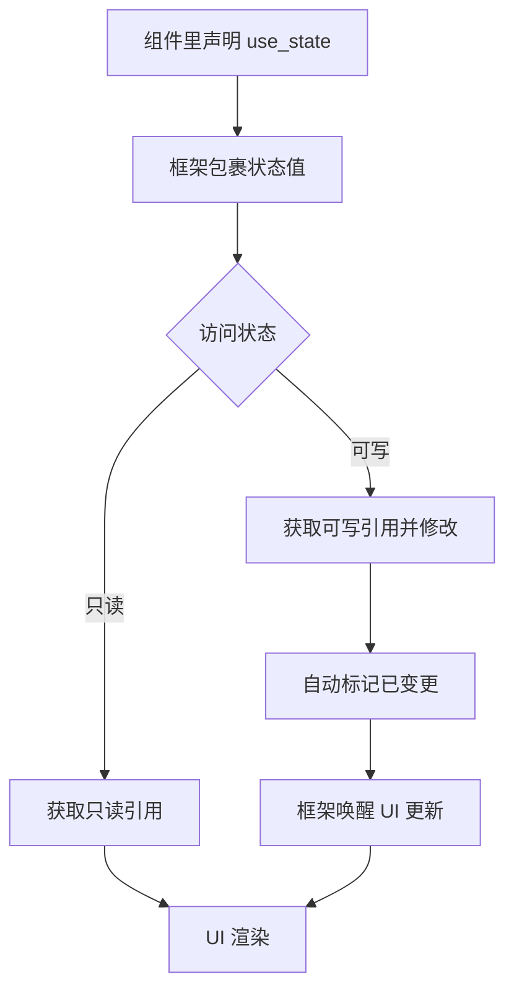

## 状态管理

上一节我们详细介绍了 Hook 系统的工作方式，帮助组件开发者实现了响应式副作用和生命周期扩展点。这一节，我们继续聊聊终端 UI 组件开发中非常重要的能力——状态管理。

### 1. use_future —— 组件里的异步任务

use_future 让你可以在组件内部声明一个异步任务（Future），每次渲染时框架会自动帮你轮询它的状态，直到任务完成。这样一来，处理异步请求、定时任务等场景就变得很简单，也不用自己手动管理 Future 的生命周期。

**主要特点：**

- 只要传入 Future，框架会自动轮询
- Future 完成后会自动清理
- 组件卸载时会自动丢弃 Future，避免资源泄漏
- 如果需要 UI 刷新，建议配合 use_state 一起用

**实现思路：**

use_future 的核心在于用一个结构体把 Future 包起来，然后让它参与组件的异步轮询流程。大致代码如下：

```rust
// 用结构体包裹 Future
pub struct UseFutureImpl {
    f: Option<BoxFuture<'static, ()>>, // 存储待轮询的 Future
}

impl UseFutureImpl {
    pub fn new<F>(f: F) -> Self
    where
        F: Future<Output = ()> + Send + 'static,
    {
        UseFutureImpl {
            f: Some(Box::pin(f)),
        }
    }
}
```

通过实现 Hook trait，这个结构体就能在组件生命周期里自动轮询 Future：

```rust
impl Hook for UseFutureImpl {
    fn poll_change(
        mut self: std::pin::Pin<&mut Self>,
        cx: &mut std::task::Context,
    ) -> std::task::Poll<()> {
        // 轮询 Future，完成后清除
        if let Some(future) = self.f.as_mut() {
            if future.as_mut().poll(cx).is_ready() {
                self.f = None; // 清除已完成的 future
            }
        }
        Poll::Pending
    }
}
```

这样，异步任务就能和组件的生命周期自然结合，需要时自动触发 UI 更新。

### 2. use_state —— 组件内部的状态管理

use_state 是 Ratatui Kit 里最常用的状态管理 Hook。它让你可以在组件内部声明和管理本地状态，实现响应式 UI。

**目标：**

- 提供简单易用的 API，像 React 的 useState 一样
- 状态访问是线程安全的
- 状态变更会自动触发 UI 更新
- 状态存储和访问效率高

**实现思路：**

use_state 的实现其实就是把状态值包裹起来，配合一些辅助结构，帮你自动追踪变更、唤醒 UI 更新。

#### 1. 状态的存储单元

状态值会被包在一个结构体里，里面除了值本身，还会记录唤醒用的 Waker 和变更标记：

```rust
struct StateValue<T> {
    value: T,
    waker: Option<Waker>,
    is_changed: bool,
}
```

#### 2. 状态句柄

State 结构体对外暴露了状态的访问接口，开发者可以通过它安全地读写状态值，不用担心并发和生命周期问题：

```rust
pub struct State<T: Send + Sync + 'static> {
    inner: GenerationalBox<StateValue<T>, SyncStorage>,
}
```

#### 3. 状态引用

StateRef 和 StateMutRef 分别用来管理只读和可变引用，保证引用安全，并且自动追踪变更：

```rust
pub struct StateRef<'a, T: 'static> {
    inner: <SyncStorage as AnyStorage>::Ref<'a, StateValue<T>>,
}

impl<T: 'static> Deref for StateRef<'_, T> {
    type Target = T;

    fn deref(&self) -> &Self::Target {
        &self.inner.value
    }
}

pub struct StateMutRef<'a, T: 'static> {
    inner: <SyncStorage as AnyStorage>::Mut<'a, StateValue<T>>,
    is_deref_mut: bool,
}

impl<T: 'static> Deref for StateMutRef<'_, T> {
    type Target = T;

    fn deref(&self) -> &Self::Target {
        &self.inner.value
    }
}

impl<T: 'static> DerefMut for StateMutRef<'_, T> {
    fn deref_mut(&mut self) -> &mut Self::Target {
        self.is_deref_mut = true;
        &mut self.inner.value
    }
}
```

当你用 StateMutRef 修改状态时，会自动标记变更，释放引用时会唤醒 Waker。

#### 4. Hook 集成

UseStateImpl 结构体负责把状态和 Hook 生命周期结合起来，检测变更并驱动 UI 更新：

```rust
struct UseStateImpl<T> {
    state: State<T>,
    _storage: Owner<SyncStorage>,
}

impl<T> Hook for UseStateImpl<T> {
    fn poll_change(
        mut self: std::pin::Pin<&mut Self>,
        cx: &mut std::task::Context,
    ) -> std::task::Poll<()> {
        if let Ok(mut value) = self.state.inner.try_write() {
            if value.is_changed {
                value.is_changed = false;
                Poll::Ready(())
            } else {
                value.waker = Some(cx.waker().clone());
                Poll::Pending
            }
        } else {
            Poll::Pending
        }
    }
}
```

这样，状态的生命周期就和组件绑定在一起，实现了自动化的状态管理和 UI 响应。

#### 状态流转过程

use_state 的状态流转大致如下：

1. 组件里用 use_state 声明一个状态
2. 框架帮你把状态值包起来
3. 你可以用只读或可写引用来访问和修改状态
4. 改了状态会自动打上“已变更”标记
5. 框架检测到变更后会唤醒 UI 更新
6. UI 重新渲染，显示最新状态



**小结：**

use_state 让你可以像写普通变量一样管理组件内部的状态，所有的并发安全、变更追踪和 UI 刷新都由框架自动处理。这样开发者只需要专注于业务逻辑，写起来既简单又高效。

### 3. 示例代码讲解与优化

下面通过一个完整的例子，演示如何在组件中结合 use_state 和 use_future 实现一个自增计数器，并优化主循环的事件响应。

首先，我们为之前的 `Text` 和 `Border` 组件实现 `update` 方法，让它们能根据新的 props 更新自身内容：

```rust
impl Component for Text {
    type Props<'a> = TextProps<'a>;

    // ...

    fn update(
        &mut self,
        props: &mut Self::Props<'_>,
        _hooks: hooks::Hooks,
        _updater: &mut ratatui_kit_principle::render::updater::ComponentUpdater<'_>,
    ) {
        *self = Self {
            text: props.text.to_string(),
            style: props.style,
            alignment: props.alignment,
        };
    }
}
// ...
impl Component for Border {
    type Props<'a> = Style;

    // ...

    fn update(
        &mut self,
        props: &mut Self::Props<'_>,
        _hooks: hooks::Hooks,
        _updater: &mut ratatui_kit_principle::render::updater::ComponentUpdater<'_>,
    ) {
        self.border_style = props.clone();
    }

    //...
}
```

接下来，新建一个 `Counter` 组件。它用 use_state 管理计数器的值，并用 use_future 启动一个异步任务，每隔一秒自动加一：

```rust
pub struct Counter;

impl Component for Counter {
    type Props<'a> = ();
    fn new(_props: &Self::Props<'_>) -> Self {
        Counter
    }

    fn update(
        &mut self,
        _props: &mut Self::Props<'_>,
        mut hooks: hooks::Hooks,
        updater: &mut ratatui_kit_principle::render::updater::ComponentUpdater<'_>,
    ) {
        let mut state = hooks.use_state(|| 0);

        hooks.use_future(async move {
            loop {
                // 模拟异步操作，比如从服务器获取数据
                tokio::time::sleep(std::time::Duration::from_secs(1)).await;
                state.set(state.get() + 1); // 更新状态
            }
        });

        let counter_text = format!("Count: {}", state.get());

        let element = Element::<View> {
            key: ElementKey::new("root"),
            props: ViewProps {
                children: vec![
                    Element::<View> {
                        key: ElementKey::new("header"),
                        props: ViewProps {
                            children: vec![
                                Element::<Text> {
                                    key: ElementKey::new("title"),
                                    props: TextProps {
                                        text: "Welcome to the Counter App",
                                        style: Style::default().bold().light_blue(),
                                        alignment: ratatui::layout::Alignment::Center,
                                    },
                                }
                                .into(),
                            ],
                            height: Constraint::Length(1),
                            ..Default::default()
                        },
                    }
                    .into(),
                    Element::<View> {
                        key: ElementKey::new("body"),
                        props: ViewProps {
                            children: vec![
                                Element::<Text> {
                                    key: ElementKey::new("number"),
                                    props: TextProps {
                                        text: counter_text.as_str(),
                                        style: Style::default().light_green(),
                                        alignment: ratatui::layout::Alignment::Center,
                                    },
                                }
                                .into(),
                            ],
                            height: Constraint::Fill(1),
                            ..Default::default()
                        },
                    }
                    .into(),
                    Element::<View> {
                        key: ElementKey::new("footer"),
                        props: ViewProps {
                            children: vec![
                            Element::<Text> {
                                key: ElementKey::new("info"),
                                props: TextProps {
                                    text: "Press q or Ctrl+C to quit, + to increase, - to decrease",
                                    style: Style::default().yellow(),
                                    alignment: ratatui::layout::Alignment::Center,
                                },
                            }
                            .into(),
                        ],
                            height: Constraint::Length(1),
                            ..Default::default()
                        },
                    }
                    .into(),
                ],
                flex_direction: Direction::Vertical,
                gap: 3,
                ..Default::default()
            },
        };

        updater.update_children([element]);
    }
}
```

在 update 方法里，use_state 用来声明和获取状态，use_future 用来定时更新状态。每次状态变化，UI 会自动刷新。

然后，修改 main 函数，直接渲染 Counter 组件：

```rust
// 主程序入口，构建组件树并启动渲染循环
#[tokio::main]
async fn main() -> io::Result<()> {
    let mut element = Element::<Counter> {
        key: ElementKey::new("counter_app"),
        props: (),
    };

    element.render_loop().await?;
    Ok(())
}
```

运行后，你会看到界面上的数字每秒自动加一。


不过你可能会发现，按 Ctrl+C 退出时，程序有时会卡顿。这是因为原来的渲染循环是先等待状态变更，再处理事件，导致响应不够及时：

```rust
// 等待组件树有状态变更（如 Hook、子组件等），避免无效刷新，提高性能
self.root_component.wait().await;

// 监听并处理用户输入事件
if let Some(Ok(event)) = event_stream.next().await {
    if let Event::Key(key) = event {
        match key.code {
            KeyCode::Char('q') => break,
            KeyCode::Char('c') if key.modifiers.contains(KeyModifiers::CONTROL) => {
                break;
            }
            _ => {}
        }
    }
}
```

为了解决这个问题，我们可以用 select! 宏同时监听状态变更和用户输入事件。这样无论是状态变化还是用户按键，程序都能第一时间响应：

```rust
pub async fn render_loop(&mut self) -> io::Result<()> {
    let mut terminal = ratatui::init();
    let mut event_stream = EventStream::new();
    loop {
        // 渲染 UI
        self.render(&mut terminal)?;

        select! {
            _ = self.root_component.wait().fuse()=>{

            }
            event = event_stream.next().fuse()=>{
                match event {
                    Some(Ok(event)) => {
                        if let Event::Key(key) = event {
                            match key.code {
                                KeyCode::Char('q') => break,
                                KeyCode::Char('c') if key.modifiers.contains(KeyModifiers::CONTROL) => {
                                    break;
                                }
                                _ => {}
                            }
                        }
                    }
                    _ => break,
                }
            }
        }
    }
    ratatui::restore();
    Ok(())
}
```

这样优化后，按下 Ctrl+C 或 q 时，程序能立刻退出，不会再卡顿。

### 总结

本节我们系统梳理了 Ratatui Kit 的状态管理原理，了解了 use_state 如何让组件拥有本地响应式状态，use_future 如何优雅地处理异步副作用。通过实际例子，你可以看到这些能力让终端 UI 的开发变得更简单、更高效。

下一节我们将进入终端事件处理的主题，介绍如何用 use_events 让组件优雅地响应键盘、鼠标等各种输入事件，让你的终端应用变得更加灵活和可交互，敬请期待！
