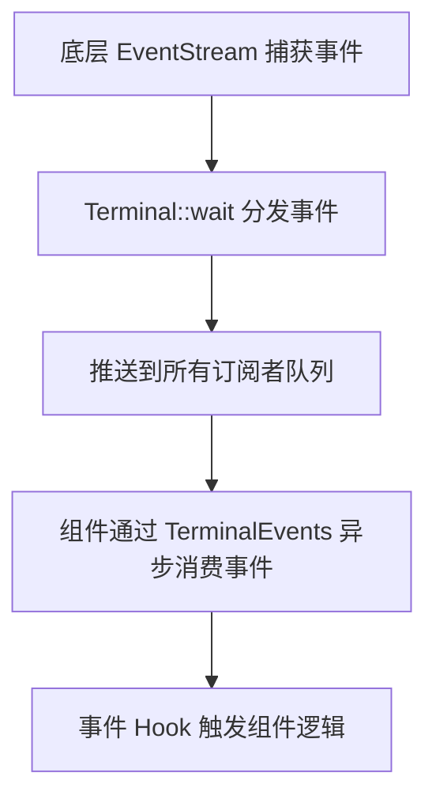
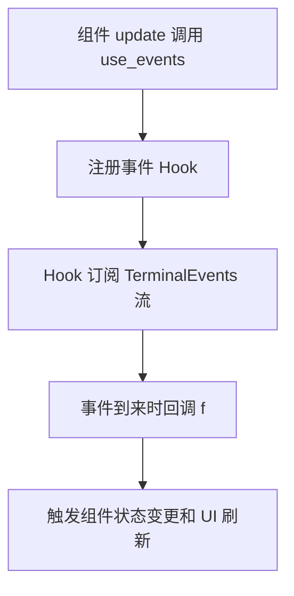

## 终端事件处理

在上一节中，我们系统梳理了 Ratatui Kit 的状态管理机制，让组件能够以响应式的方式保存和变更自身状态。但要让终端 UI 真正“动”起来，关键还在于如何高效、优雅地响应用户输入事件，实现实时交互。

本节将聚焦于 Ratatui Kit 的终端事件处理机制，全面梳理事件流的捕获、分发与消费流程，并结合 use_events Hook，揭示组件如何通过事件系统实现灵活且解耦的交互能力。

### 1. 终端事件系统：统一捕获与分发

在 TUI 应用中，事件驱动是实现交互的核心。Ratatui Kit 通过对终端事件流的统一封装，实现了事件的集中捕获、分发与异步消费，极大提升了事件处理的灵活性和可维护性。

#### 1.1 Terminal 结构体的核心职责

`Terminal` 结构体不仅负责终端的渲染，还承担了事件流的统一管理。其内部维护了一个事件流（`EventStream`）和一组事件订阅者（subscribers），实现了事件的多路分发。

- `inner: ratatui::DefaultTerminal`：底层终端渲染对象。
- `event_stream: EventStream`：crossterm 提供的异步事件流。
- `subscribers`：所有事件订阅者的弱引用集合。
- `received_ctrl_c`：标记是否收到 Ctrl+C 事件。

#### 1.2 为什么要用订阅-分发机制？

传统事件处理往往集中在主循环，导致代码耦合度高、扩展性差。Ratatui Kit 采用订阅-分发机制，每个组件都可以独立“订阅”自己关心的事件，事件源统一“分发”到各个订阅者。这种模式带来了如下优势：

- **解耦**：事件的产生与消费分离，组件间互不干扰，便于维护和复用。
- **灵活**：支持多个订阅者并发消费事件，适合复杂交互和多组件场景。
- **异步友好**：天然适配 async/await，事件流可被异步轮询，提升响应效率。
- **易于扩展**：可在此基础上实现事件过滤、冒泡、优先级等高级特性。

> 这种机制类似于前端的事件总线（Event Bus）或发布-订阅（Pub/Sub）模式，是现代 UI 框架实现高可维护性和高扩展性的关键。

#### 1.3 事件流的订阅与分发流程



#### 1.4 事件订阅：为每个组件分发独立事件流

通过 `Terminal::events()` 方法，组件可以获得一个独立的 `TerminalEvents` 事件流。每个事件流内部维护一个事件队列和 waker，实现异步事件消费。

```rust
pub fn events(&mut self) -> TerminalEvents {
    let inner = Arc::new(Mutex::new(TerminalEventsInner {
        pending: VecDeque::new(),
        waker: None,
    }));
    self.subscribers.push(Arc::downgrade(&inner));
    TerminalEvents { inner }
}
```

#### 1.5 事件分发：主循环统一推送事件

`Terminal::wait()` 方法不断从底层事件流读取事件，并将事件分发给所有订阅者：

- 检测到 Ctrl+C 时，设置 `received_ctrl_c` 标记。
- 对每个订阅者，将事件推入其队列，并唤醒等待的 waker。
- 已释放的订阅者会被自动移除。

```rust
pub async fn wait(&mut self) {
    while let Some(Ok(event)) = self.event_stream.next().await {
        // 检测 Ctrl+C 事件
        if let Event::Key(key) = event {
            if matches!(key.code, KeyCode::Char('c'))
                && key.modifiers.contains(KeyModifiers::CONTROL)
            {
                self.received_ctrl_c = true;
                return;
            }
        }

        // 分发事件到所有订阅者
        self.subscribers.retain(|subscriber| {
            if let Some(inner) = subscriber.upgrade() {
                let mut subscriber = inner.lock().unwrap();
                subscriber.pending.push_back(event.clone());

                // 唤醒等待事件的 waker
                if let Some(waker) = subscriber.waker.take() {
                    waker.wake();
                }

                true
            } else {
                // 订阅者已被释放则移除
                false
            }
        });
    }
}
```

#### 1.6 TerminalEvents 的异步消费

`TerminalEvents` 实现了 `Stream` trait，支持异步轮询事件。每次 poll 时，如果队列有事件则直接返回，否则注册 waker，等待新事件到来。

```rust
impl Stream for TerminalEvents {
    type Item = Event;

    fn poll_next(
        self: std::pin::Pin<&mut Self>,
        cx: &mut std::task::Context<'_>,
    ) -> std::task::Poll<Option<Self::Item>> {
        let mut inner = self.inner.lock().unwrap();

        // 如果有事件，直接返回
        if let Some(event) = inner.pending.pop_front() {
            Poll::Ready(Some(event))
        } else {
            // 没有事件则注册 waker，等待唤醒
            inner.waker = Some(cx.waker().clone());
            Poll::Pending
        }
    }
}
```

#### 1.7 渲染主循环的升级

随着终端事件流的统一封装，原本直接依赖 `ratatui::DefaultTerminal` 的部分现在应全部切换为自定义的 `Terminal`，以保证事件的集中管理和分发。为便于组件访问事件流，`ComponentUpdate` 需新增 `&mut Terminal` 参数，`InstantiatedComponent` 的 `update` 方法也需同步接收 `&mut Terminal`。

```rust
impl<'a> Tree<'a> {
    // ...existing code...
    pub fn render(&mut self, terminal: &mut Terminal) -> io::Result<()> {
        // 传入新的 Terminal 参数
        self.root_component.update(self.props.borrow(), terminal);

        terminal.draw(|frame| {
            let area = frame.area();
            let mut drawer = ComponentDrawer::new(frame, area);
            self.root_component.draw(&mut drawer);
        })?;

        Ok(())
    }

    pub async fn render_loop(&mut self) -> io::Result<()> {
        let mut terminal = Terminal::new();
        loop {
            // 渲染 UI
            self.render(&mut terminal)?;

            if terminal.received_ctrl_c() {
                break;
            }

            // 等待组件状态或终端事件
            select(self.root_component.wait().boxed(), terminal.wait().boxed()).await;

            if terminal.received_ctrl_c() {
                break;
            }
        }
        ratatui::restore();
        Ok(())
    }
}
```

> 通过这种方式，所有事件都由统一的 `Terminal` 处理，组件在更新时可直接访问和订阅事件流，主循环结构更清晰，事件响应也更加高效。

### 2. use_events：让组件优雅响应终端事件

有了统一的事件流，如何在组件中优雅地消费这些事件？这就是 `use_events` Hook 的作用。

`use_events` 是一个专为事件处理设计的 Hook，允许组件订阅终端事件流，并在事件到来时自动触发逻辑和 UI 刷新。其实现原理与 `use_state` 类似，但专注于事件驱动。

#### 2.1 use_events Hook 的核心原理

- 组件通过 Hooks::use_events 注册事件回调。
- Hook 内部自动订阅 TerminalEvents 流，并在事件到来时调用回调。
- 支持全局事件和局部（组件区域内）事件两种模式。
- 事件流与组件生命周期自动绑定，无需手动管理。

#### 2.2 use_events 关键实现

```rust
// ...existing code...
// UseEvents trait：为 Hooks 提供 use_events 和 use_local_events 两种事件 Hook
pub trait UseEvents: private::Sealed {
    /// 订阅全局终端事件，所有事件都会回调 f
    fn use_events<F>(&mut self, f: F)
    where
        F: FnMut(Event) + Send + 'static;

    /// 只处理当前组件区域内的事件（如鼠标事件），回调 f
    fn use_local_events<F>(&mut self, f: F)
    where
        F: FnMut(Event) + Send + 'static;
}

// Hooks 实现 UseEvents trait
impl UseEvents for Hooks<'_> {
    fn use_events<F>(&mut self, f: F)
    where
        F: FnMut(Event) + Send + 'static,
    {
        // 注册全局事件 Hook
        let h = self.use_hook(move || UseEventsImpl {
            events: None,
            component_area: Default::default(),
            in_component: false,
            f: None,
        });
        h.f = Some(Box::new(f));
    }

    fn use_local_events<F>(&mut self, f: F)
    where
        F: FnMut(Event) + Send + 'static,
    {
        // 注册局部事件 Hook（只处理组件区域内事件）
        let h = self.use_hook(move || UseEventsImpl {
            events: None,
            component_area: Default::default(),
            in_component: true,
            f: None,
        });
        h.f = Some(Box::new(f));
    }
}

// 事件 Hook 的具体实现体
struct UseEventsImpl {
    f: Option<Box<dyn FnMut(Event) + Send>>, // 事件回调闭包
    events: Option<TerminalEvents>,          // 事件流
    in_component: bool,                      // 是否只处理组件区域内事件
    component_area: Rect,                    // 组件区域
}

// 实现 Hook trait，使事件 Hook 能参与组件生命周期
impl Hook for UseEventsImpl {
    fn poll_change(
        mut self: std::pin::Pin<&mut Self>,
        cx: &mut std::task::Context,
    ) -> std::task::Poll<()> {
        // 轮询事件流，处理所有就绪事件
        while let Some(Poll::Ready(Some(event))) = self
            .events
            .as_mut()
            .map(|events| pin!(events).poll_next(cx))
        {
            let area = self.component_area;
            let in_component = self.in_component;
            if let Some(f) = &mut self.f {
                if in_component {
                    // 只处理组件区域内的鼠标事件
                    match event {
                        Event::Mouse(mouse_event) => {
                            if mouse_event.row >= area.y && mouse_event.column >= area.x {
                                let row = mouse_event.row - area.y;
                                let column = mouse_event.column - area.x;
                                if row < area.height && column < area.width {
                                    f(event);
                                }
                            }
                        }
                        _ => {
                            f(event);
                        }
                    }
                } else {
                    // 全局事件直接回调
                    f(event);
                }
            }
        }
        Poll::Pending
    }

    fn post_component_update(&mut self, updater: &mut ComponentUpdater) {
        // 组件 update 后，首次初始化事件流
        if self.events.is_none() {
            self.events = Some(updater.terminal().events());
        }
    }

    fn pre_component_draw(&mut self, drawer: &mut ComponentDrawer) {
        // 绘制前记录当前组件区域，用于局部事件判断
        self.component_area = drawer.area;
    }
}
```

#### 2.3 use_events 响应流程图



### 3. 实战案例：用事件驱动计数器

下面通过一个计数器组件，演示如何用 use_events 响应键盘事件，实现交互式 UI：

```rust
impl Component for Counter {
    // ...

    fn update(
        &mut self,
        _props: &mut Self::Props<'_>,
        mut hooks: hooks::Hooks,
        updater: &mut ratatui_kit_principle::render::updater::ComponentUpdater<'_>,
    ) {
        let mut state = hooks.use_state(|| 0);

        hooks.use_events(move |event| match event {
            Event::Key(KeyEvent {
                kind: KeyEventKind::Press,
                code,
                ..
            }) => match code {
                KeyCode::Up => {
                    state.set(state.get() + 1);
                }
                KeyCode::Down => {
                    state.set(state.get() - 1);
                }
                _ => {}
            },
            _ => {}
        });

        // ...
    }
}
```

> 通过 use_events，组件可以像前端一样优雅地响应终端事件，实现复杂交互逻辑。

## 总结

本节我们系统梳理了 Ratatui Kit 的终端事件处理机制，从事件流的捕获、分发到组件内的消费与响应，展示了事件驱动与 Hook 系统的深度结合。通过统一的事件流和 use_events Hook，组件可以实现高度解耦、响应式、异步友好的交互逻辑，让终端 UI 拥有媲美前端的开发体验。

下一节，我们将深入解析 Context（上下文）机制，学习如何在组件树中实现全局数据的共享与依赖注入，让跨组件的状态和服务流转变得高效且优雅。敬请期待！
